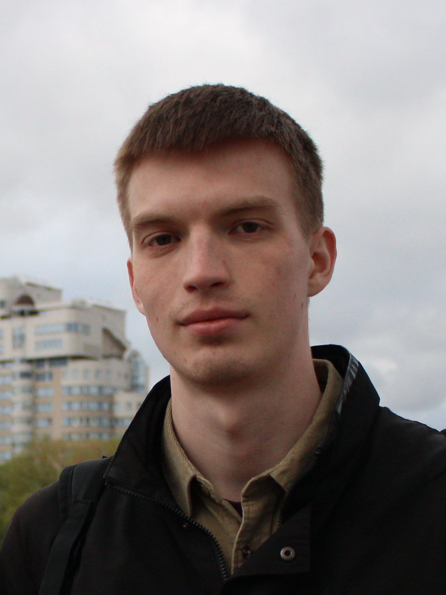

# Kovaleko's bot
Open-source STM32 line follower for 45$

# Робот Коваленко

Робот для езды по линии на базе STM32 за 3500 рублей.

## Содержание
- [О проекте](#-О-проекте)
- [Инструкция](#-Инструкция)
- [Команда проекта](#-Команда-проекта) 

## 🚀 О проекте

В __Центре молодёжной робототехники МГТУ им. Н. Э. Баумана__ мы на протяжении нескольких лет регулярно проводим мастер-классы по робототехнике в самых разных форматах — от коротких вводных занятий до однодневных интенсивов и летних школ для школьников и студентов.

За это время мы накопили большой практический опыт и пришли к пониманию того, каким должен быть удобный и эффективный учебный робот для езды по линии: доступный по стоимости, простой в сборке и одновременно обладающий высоким образовательным потенциалом.В основе робота лежит __промышленный микроконтроллер STM32__, широко применяемый в реальных инженерных и промышленных системах, что позволяет сразу знакомиться с профессиональными инструментами и подходами.

Этот репозиторий — наше __open-source видение экосистемы__ обучающего робота для езды по линии. Мы открываем схемы, прошивки и методические материалы, чтобы любой желающий мог собрать такого робота, разобраться в его устройстве, поэкспериментировать с алгоритмами и внести свой вклад в развитие проекта.

## 📚 Инструкция
### Электронные компоненты и пайка
### 3д печать и сборка
### Программирование

## 🤝 Команда проекта 

<table style="text-align: left; vertical-align: middle;">
  <tr>
    <td></td>
    <td>Руководитель проекта</td>
    <td><a href="https://t.me/popovIam">Попов Александр</a></td>
  </tr>
  <tr>
    <td>Poodle</td>
    <td>Инженер</td>
    <td>Коваленко Егор</td>
  </tr>
  <tr>
    <td>9</td>
    <td>Электронщик</td>
    <td>Алещинин Андрей</td>
  </tr>
</table>

Проект создан в МГТУ им. Н. Э. Баумана на базе Центра молодежной робототехники - студенческой организации, занимающейся поддержкой и развитием студенческого научно-технического творчества. 

[Телеграмм ЦМР](https://t.me/robotics_bmstu)

[ВКонтакте ЦМР](https://vk.com/robotics_bmstu?from=groups)

 

[Наверх](#top)